# MoneyView

<p align="center">
  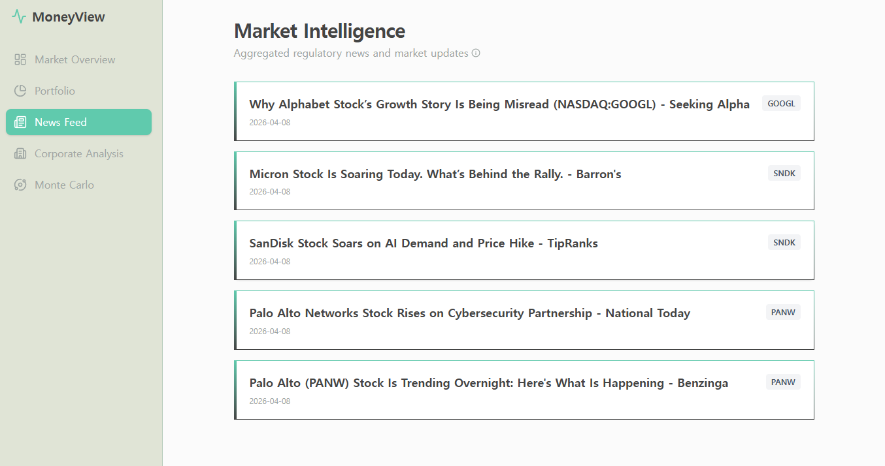
</p>

<p align="center">
  <strong>Local-first financial analytics workspace</strong><br/>
  Market monitoring, portfolio attribution, corporate valuation, and Monte Carlo simulation in one dashboard.
</p>

<p align="center">
  <a href="http://localhost:3000"><strong>App</strong></a> ·
  <a href="http://localhost:3000/portfolio"><strong>Portfolio</strong></a> ·
  <a href="http://localhost:3000/corporate"><strong>Corporate</strong></a> ·
  <a href="http://localhost:3000/monte-carlo"><strong>Monte Carlo</strong></a> ·
  <a href="http://127.0.0.1:8000/docs"><strong>API Docs</strong></a>
</p>

## Overview

MoneyView combines:
- a FastAPI backend in [`apps/api`](./apps/api)
- a Next.js frontend in [`apps/web`](./apps/web)
- local SQLite-backed workflows for analytics, reporting, and experimentation

Core product areas:
- **Market Overview** for macro snapshot tracking
- **Portfolio** for attribution, holdings, and benchmark comparison
- **Corporate Analysis** for valuation diagnostics and assumption-driven modeling
- **Simulation Lab** for Monte Carlo path, risk, valuation, and correlation analysis

## Product Screens

### Market Overview

Real-time style cards for indices, commodities, FX, and crypto.

<p align="center">
  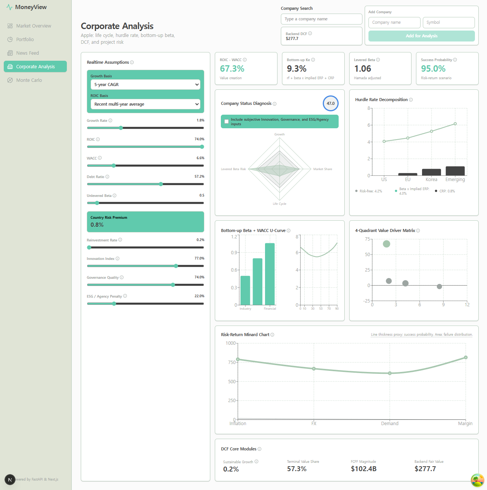
</p>

### Portfolio Command Center

Holdings tracking, weighted portfolio testing, snapshot comparison, attribution effects, and drill-down detail in one workspace.

<table>
  <tr>
    <td width="33%">
      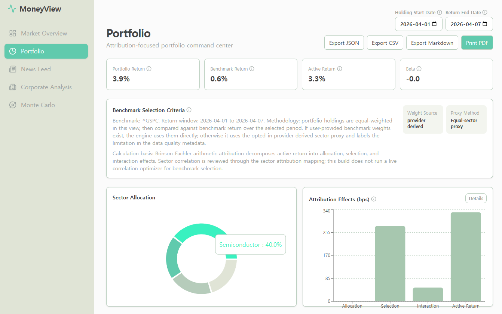
    </td>
    <td width="33%">
      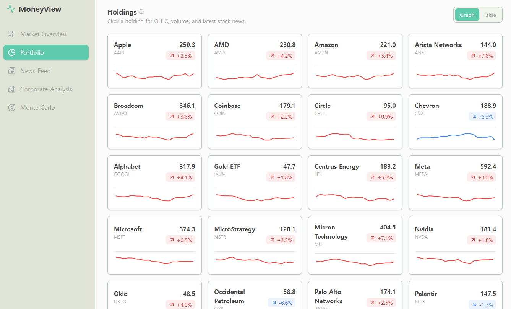
    </td>
    <td width="33%">
      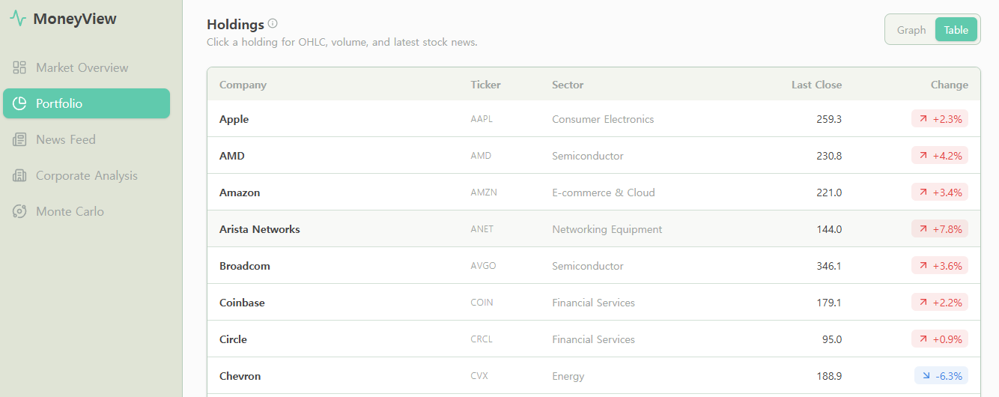
    </td>
  </tr>
</table>

### Corporate Analysis

Realtime assumptions, company diagnostics, hurdle-rate decomposition, and valuation visuals.

<p align="center">
  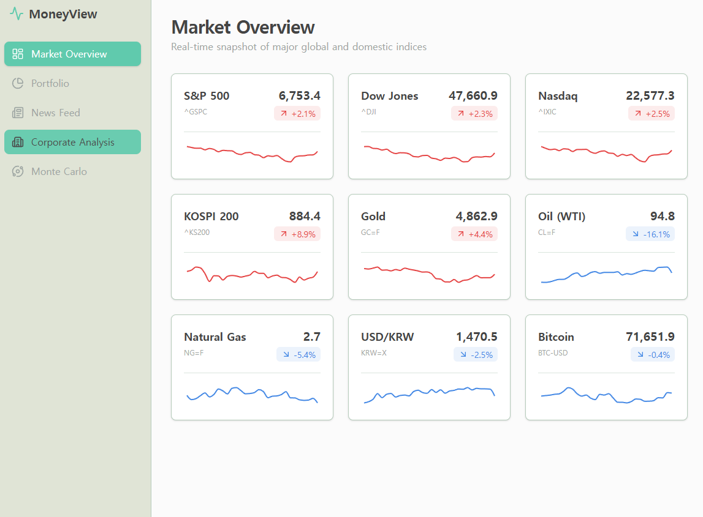
</p>

### Simulation Lab

Monte Carlo workflows for path simulation, risk analysis, valuation uncertainty, and portfolio correlation structure.

<table>
  <tr>
    <td width="50%">
      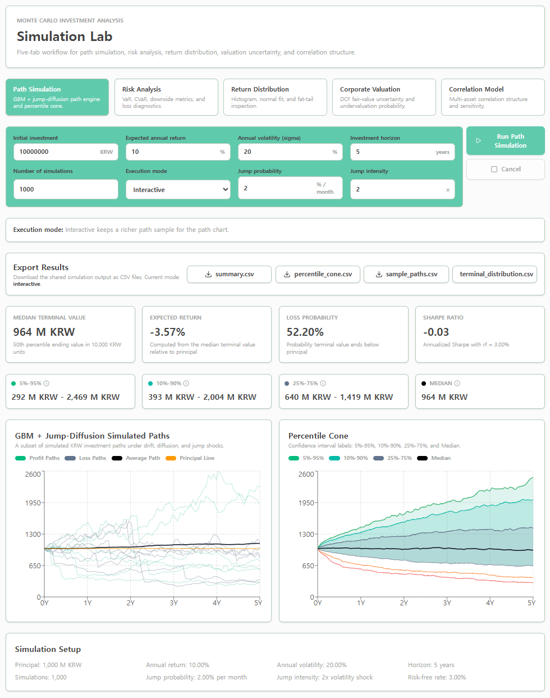
    </td>
    <td width="50%">
      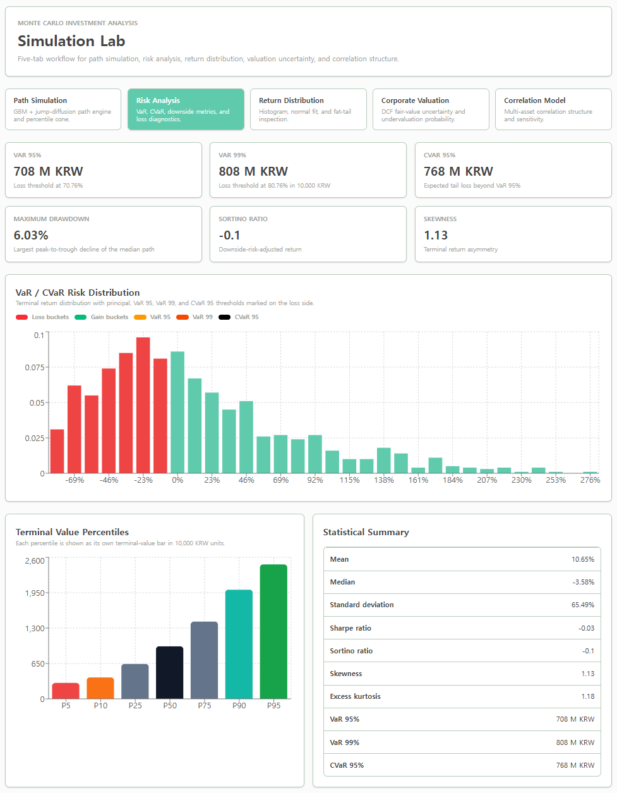
    </td>
  </tr>
  <tr>
    <td width="50%">
      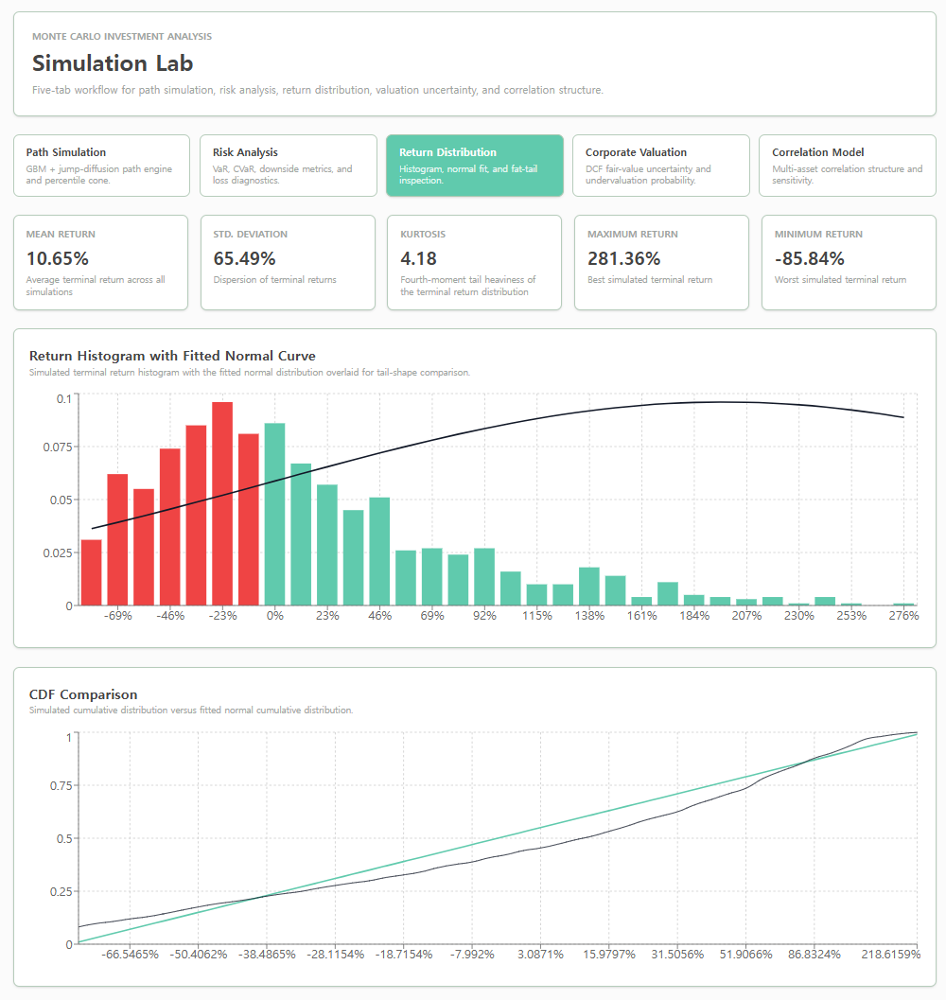
    </td>
    <td width="50%">
      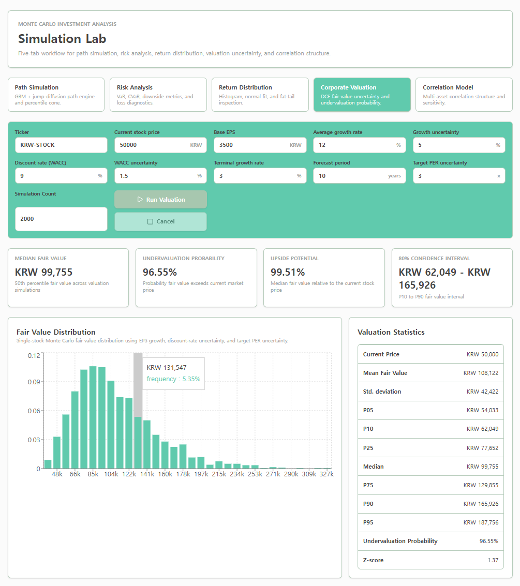
    </td>
  </tr>
  <tr>
    <td colspan="2">
      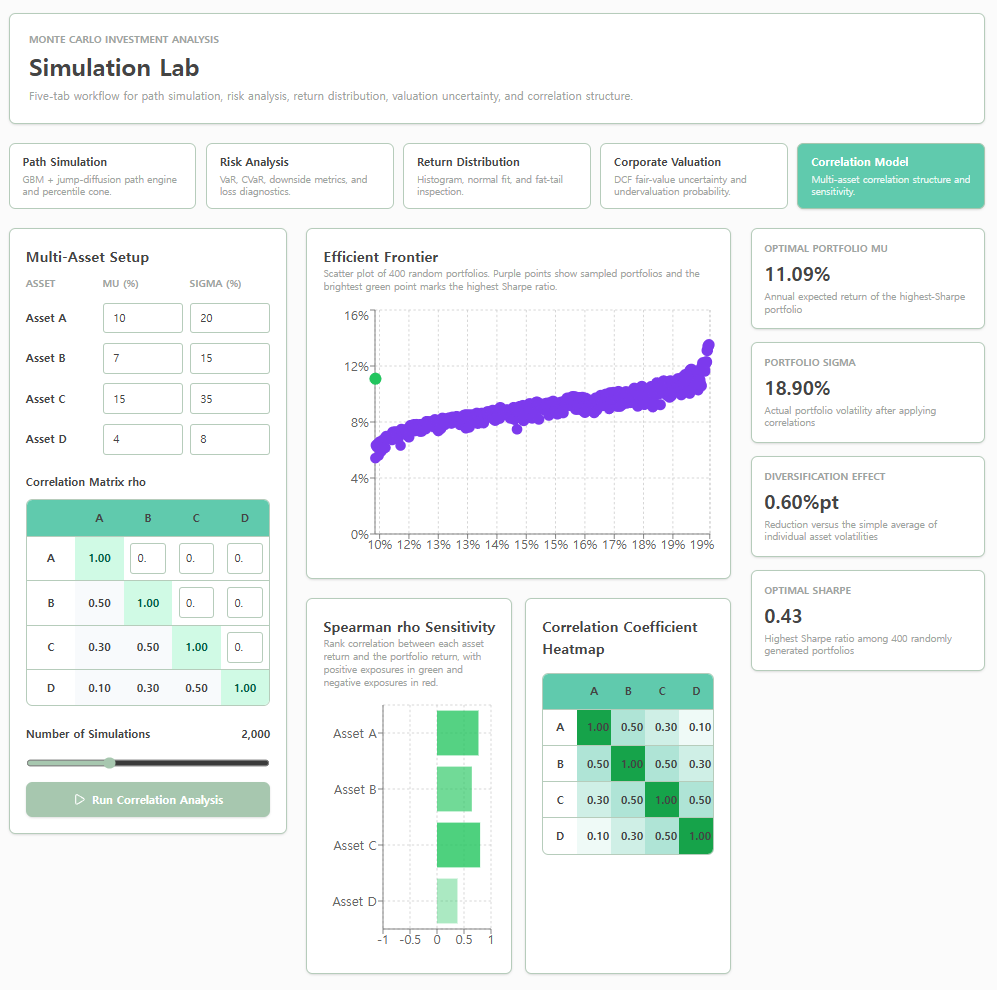
    </td>
  </tr>
</table>

## Feature Map

| Area | What it covers |
|---|---|
| Market Overview | Major indices, commodities, FX, crypto, and quick trend cards |
| Portfolio | Portfolio return, benchmark return, active return, beta, attribution effects, holdings detail |
| Corporate Analysis | DCF-oriented valuation assumptions, status diagnosis, hurdle-rate decomposition, value-driver views |
| Simulation Lab | Path simulation, risk analysis, return distribution, corporate valuation, correlation model |

## Stack

| Layer | Tools |
|---|---|
| Frontend | Next.js, React, TypeScript, Recharts |
| Backend | FastAPI, Pydantic |
| Data | SQLite, local cache, Yahoo/yfinance-based ingestion paths |
| Python Tooling | Conda, `uv`, `pytest` |
| Frontend Tooling | Node.js, `npm` |

## Requirements

- Conda
- Python `>=3.12`
- `uv`
- Node.js `>=20`
- `npm`

## Quick Start

Install the global command once:

```powershell
powershell.exe -ExecutionPolicy Bypass -File scripts\install_run_command.ps1
```

Then from `cmd.exe` or PowerShell in any folder, start MoneyView with one command:

```cmd
run MoneyView
```

The global `run` command delegates to the repo-root `run.cmd` wrapper, which forwards to the canonical launcher at `scripts\start_local.ps1`.

If you do not want the global command, you can still run from the project root with:

```cmd
run MoneyView
```

From PowerShell in the project root:

```powershell
.\run.cmd MoneyView
```

The launcher:
- starts the FastAPI backend
- starts the Next.js frontend
- opens two dedicated PowerShell windows: one for the API Server and one for `next-server`
- auto-installs missing backend/frontend dependencies when needed
- prefers the active Conda env, but treats `base` as a fallback and uses the `moneyview` Conda env when available
- writes the backend discovery file
- writes persistent runtime logs under `data/cache/logs`
- stops with an explicit backend or frontend startup error if a process does not complete
- opens the app in the browser

### Resource cost and developer tools

`run MoneyView` uses roughly **1.5–1.7 GB of RAM** (about 85% of that is `next dev`;
the FastAPI backend is ~156 MB). CPU is bursty during route compilation, then idle.
If you are using MoneyView rather than developing the frontend, `npm run build && npm run start`
in `apps/web` is substantially lighter.

Two developer dashboards exist and are **not linked from any navigation**:

| URL | What |
| --- | --- |
| `http://localhost:3000/dev/performance` | Request waterfalls, scope breakdown, per-ticker cost, cache effectiveness |
| `http://localhost:3000/dev/monitor` | Live event tail and latency panels |

Both need `MONEYVIEW_DEV_MONITOR=true` set for the API process. `run MoneyView` does not
set it, so by default these pages render an empty "disabled" state. The flag costs
12–19% request latency and up to 128 MB, so it is off deliberately.

See [`docs/local-run-resources.md`](docs/local-run-resources.md) for measured figures,
the measurement method, and operational hazards (notably: a `next dev` that logs
"Ready" but never binds its port does not exit, and has reached 5 GB).

Direct launcher fallback:

```powershell
powershell.exe -ExecutionPolicy Bypass -File scripts\start_local.ps1 -OpenBrowser
```

Useful URLs:

- App: `http://localhost:3000`
- Portfolio: `http://localhost:3000/portfolio`
- Corporate Analysis: `http://localhost:3000/corporate`
- Monte Carlo Lab: `http://localhost:3000/monte-carlo`
- API health: `http://127.0.0.1:8000/api/v1/health`
- API docs: `http://127.0.0.1:8000/docs`

Saved runtime logs:

- API Server: `data/cache/logs/api-server.log`
- next-server: `data/cache/logs/next-server.log`

To stop the app, close the spawned PowerShell windows.

## Watchlist Bootstrap

Portfolio holdings are stored in the local SQLite `watchlist` table and that table is the source of truth.

On first run:
- if the DB watchlist already has rows, MoneyView uses those rows
- if the DB watchlist is empty and `apps/api/services/webscrap/stock_targets.json` exists, MoneyView seeds from that file once
- if the DB watchlist is empty and that JSON file is missing, MoneyView seeds a small built-in default watchlist once

After you add or delete holdings from the Portfolio page, those DB changes become authoritative and automatic bootstrap seeding does not overwrite them.

The current Portfolio page uses saved positive watchlist weights when they exist. If no positive saved weights exist, it falls back to an equal-weight basket. If saved weights total less than `100%`, the remaining balance is treated as implied cash in the attribution flow.

See [`docs/portfolio-tab.md`](./docs/portfolio-tab.md) for the full Portfolio screen breakdown.

See [`docs/corporate-analysis-tab.md`](./docs/corporate-analysis-tab.md) for the full Corporate Analysis screen breakdown.

See [`docs/monte-carlo-tab.md`](./docs/monte-carlo-tab.md) for the full Monte Carlo screen breakdown.

## First-Time Setup

```powershell
conda create -n moneyview python=3.13 -y
conda activate moneyview
python -m pip install -U uv
uv pip install -e ".[dev]"
cd apps\web
npm install
cd ..\..
```

Create the local env file from the template:

```powershell
Copy-Item config\.env.example config\.env
```

If frontend dependencies are missing, the launcher can install them:

```cmd
run MoneyView -InstallDeps
```

From PowerShell:

```powershell
.\run.cmd MoneyView -InstallDeps
```

Normal Quick Start also attempts that install automatically when dependencies are missing.
For backend packages, the launcher installs into the selected runtime env. If your active env is `base` and a `moneyview` env exists, the launcher now prefers `moneyview`.

## Run Backend

```powershell
python -m uvicorn apps.api.main:app --host 127.0.0.1 --port 8000 --reload
```

Health check:

```powershell
curl http://127.0.0.1:8000/api/v1/health
```

## Run Frontend

```powershell
cd apps\web
npm install
npm run dev
```

If PowerShell blocks `npm`, use:

```powershell
npm.cmd run dev
```

## Launcher Options

Check prerequisites without starting processes:

```cmd
run MoneyView -CheckOnly
```

From PowerShell:

```powershell
.\run.cmd MoneyView -CheckOnly
```

Other useful launcher options:

```cmd
run MoneyView -AutoPort
run MoneyView -InstallDeps
run MoneyView -BuildWeb -ProductionWeb
```

## Tests and Validation

Run the Python test suite:

```powershell
pytest -q
```

Validate the local SQLite schema:

```powershell
python scripts/validate_sqlite_schema.py
```

Strict schema validation:

```powershell
python scripts/validate_sqlite_schema.py --strict
```

Dry-run ingestion sources:

```powershell
python scripts/ingest_dry_run.py
```

Preview local DB reconstruction:

```powershell
python scripts/reconstruct_sqlite_db.py
```

Apply local DB reconstruction with backup:

```powershell
python scripts/reconstruct_sqlite_db.py --apply
```

Benchmark SQLite workloads:

```powershell
python scripts/benchmark_sqlite.py
```

Benchmark finance workloads:

```powershell
python scripts/benchmark_finance.py
```

## Shared Schema Types

Backend Pydantic models are the source of truth for public portfolio/report contracts.

Regenerate shared types after changing public models:

```powershell
python scripts/export_schema.py
npx json2ts packages/shared-types/generated/portfolio.schema.json > packages/shared-types/generated/portfolio.ts
```

Generated output:

- [`packages/shared-types/generated/portfolio.ts`](./packages/shared-types/generated/portfolio.ts)

Check for generated drift:

```powershell
git diff --exit-code packages/shared-types
```

Reference:

- [`docs/architecture/schema-evolution.md`](./docs/architecture/schema-evolution.md)

## Key API Endpoints

Reference:

- [`docs/api-usage.md`](./docs/api-usage.md)

### Portfolio Attribution

`POST /api/v1/portfolio/attribution`

Example request:

```json
{
  "tickers": ["AAPL", "MSFT", "TSLA"],
  "weights": [0.3333, 0.3333, 0.3333],
  "benchmark": "^GSPC",
  "period": "5y",
  "currency": "USD",
  "attribution_method": "brinson_fachler_arithmetic",
  "allow_synthetic_fallback": true,
  "allow_benchmark_proxy": true
}
```

### Report Summary

`POST /api/v1/report/summary`

### Watchlist

`GET /api/v1/portfolio/watchlist`

`POST /api/v1/portfolio/watchlist`

Example request:

```json
{
  "ticker": "AAPL",
  "name": "Apple Inc.",
  "sector": "Information Technology",
  "group_name": "core",
  "weight": 0.0
}
```

`DELETE /api/v1/portfolio/watchlist/{ticker}`

## Repository Layout

```text
MoneyView/
├─ apps/
│  ├─ api/
│  └─ web/
├─ config/
├─ data/
│  ├─ cache/
│  ├─ img/
│  ├─ processed/
│  └─ raw/
├─ docs/
├─ guideline/
├─ packages/
├─ scripts/
└─ tests/
```

## Notes

- Screenshots in this README are loaded from [`data/img`](./data/img).
- The app is designed for local development and experimentation first.
- If PowerShell shows execution-policy warnings after commands complete, that is usually non-blocking unless the command itself fails.
