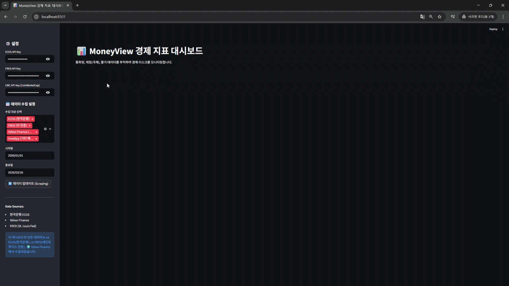
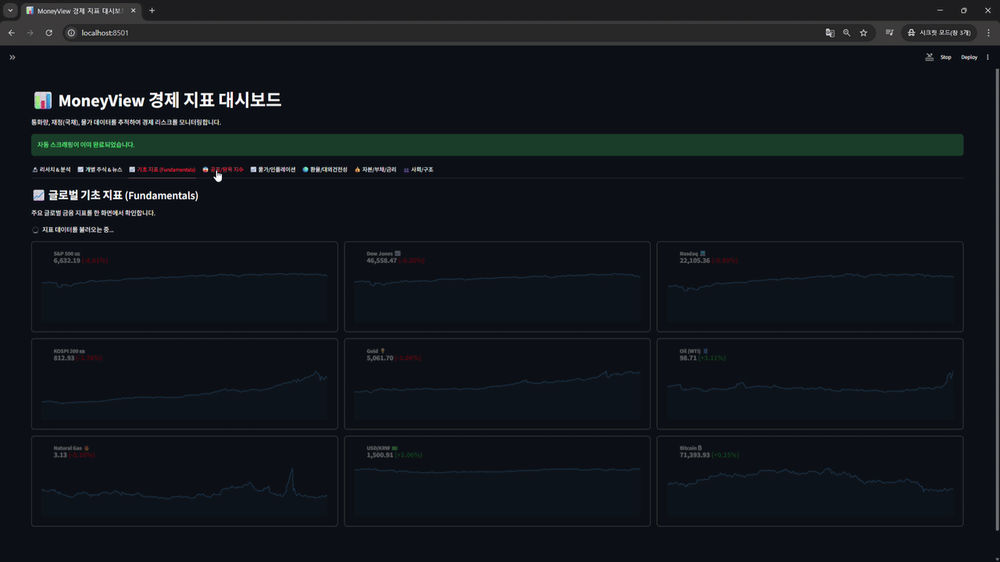

# Analysis and Visualization of Korean Economic Indicators

> [!NOTE]
> plz, check the `[!]` section, if u haven't do this it didn't worked

## Show Stock Price



## Show Economy Index + Macro Events + Fear & Greed Index...



## Quick start
the codebase prooven with conda

### Setting virtual env
```
conde create -n [any] python=3.13
pip install uv
conda activate [any]
```
### install dependency
```
uv pip install -e .
```
### [!] Configuration File with Required Declarations

#### Define `#1 apikey.json` Format
file location: `./apikey.json`
```
{
    "ECOS_API_KEY": "",
    "FRED": "",
    "nasdaq": "",
    "REB부동산원": "",
    "KOSIS": "",
    "CMC_API_KEY": ""
}
```

#### Define `#2 stock_targets.json` Format
file location: `./WebScrap/stock_targets.json`
```
{
"custom":{
    "targets": [
        {"name": "Apple", "ticker": "AAPL", "sector": "Consumer Electronics"},
        {"name": "Tesla", "ticker": "TSLA", "sector": "Automotive"},
        {"name": "Centrus Energy", "ticker": "LEU", "sector": "Nuclear Energy"}
    ]
},
"total": {
    "targets": [
        {"name": "Plug Power", "ticker": "PLUG", "sector": "Clean Energy"},
        ...
    ]
}
}
```

### Error
```
Using Python 3.11.14 environment at: C:\Users\VIP\anaconda3\envs\money
  × No solution found when resolving dependencies:
  ╰─▶ Because the current Python version (3.11.14) does not satisfy Python>=3.13 and money==0.1.0 depends on Python>=3.13, we can conclude that money==0.1.0 cannot be used.
      And because only money==0.1.0 is available and you require money, we can conclude that your requirements are unsatisfiable.
```
if Error occured like this, just create new Virtual Environment.
#### Delete conda
```
conda env remove -n [any]
```